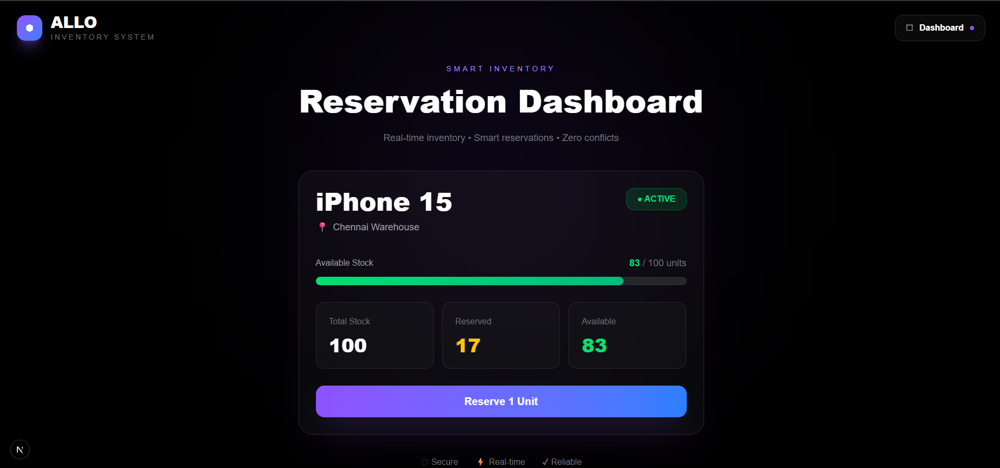
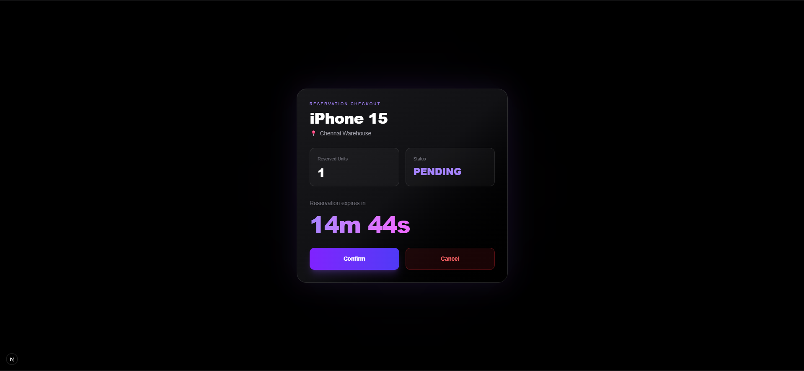

# Allo Inventory Reservation System

A full-stack Smart Inventory Reservation System built using Next.js, Prisma, PostgreSQL, and Tailwind CSS.

---

# Features

- Product inventory management
- Warehouse inventory tracking
- Real-time inventory reservations
- Reservation confirmation and cancellation
- Automatic stock updates
- Reservation expiry countdown
- Premium responsive dashboard UI
- Concurrency-safe reservation handling

---

# Tech Stack

- Next.js 16
- TypeScript
- Prisma ORM
- PostgreSQL
- Tailwind CSS

---

# Project Structure

```bash
src/
 ├── app/
 │   ├── api/
 │   ├── reservation/
 │   └── page.tsx
 ├── lib/
prisma/
```

---

# Setup Instructions

## 1. Clone Repository

```bash
git clone https://github.com/karnadeviamrutha/allo-inventory-system.git
```

---

## 2. Install Dependencies

```bash
npm install
```

---

## 3. Create Environment File

Create `.env`

```env
DATABASE_URL=your_database_url
```

---

## 4. Run Prisma

```bash
npx prisma generate
npx prisma db push
```

---

## 5. Start Development Server

```bash
npm run dev
```

Open:

```text
http://localhost:3000
```

---

# Database Models

## Product

Stores product details.

## Warehouse

Stores warehouse information.

## Inventory

Tracks stock quantity per warehouse.

## Reservation

Handles temporary stock reservations.

---

# Reservation Flow

1. User reserves inventory
2. Reservation gets created
3. Reserved stock increases
4. Countdown timer starts
5. User can:
   - Confirm reservation
   - Cancel reservation
6. Inventory updates automatically

---

# Available Stock Formula

```text
availableStock = totalQuantity - reservedQuantity
```

---

# Concurrency Handling

Prisma transactions are used to prevent overselling during simultaneous reservation requests.

This ensures:

- atomic updates
- consistent stock values
- safe concurrent reservations

---

# Reservation Expiry

Expired reservations are automatically released and inventory stock is restored.

The system uses lazy cleanup logic during reservation fetch operations.

---

# UI Features

- Premium glassmorphism design
- Responsive layout
- Real-time countdown timer
- Modern dashboard interface
- Gradient premium styling

---

# API Endpoints

## Products

```http
GET /api/products
POST /api/products
```

---

## Warehouses

```http
GET /api/warehouses
POST /api/warehouses
```

---

## Inventory

```http
GET /api/inventory
POST /api/inventory
```

---

## Reservations

```http
POST /api/reservations
GET /api/reservations/[id]
POST /api/reservations/[id]/confirm
POST /api/reservations/[id]/release
```

---

# Deployment

Frontend:
- Vercel

Database:
- PostgreSQL

---
# Screenshots

## Dashboard



---

## Reservation Checkout



---

# Author

KARNA DEVI AMRUTHA
